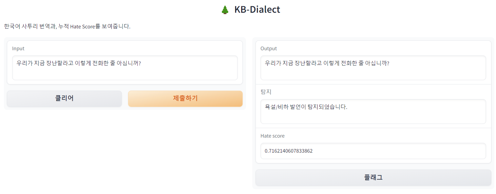
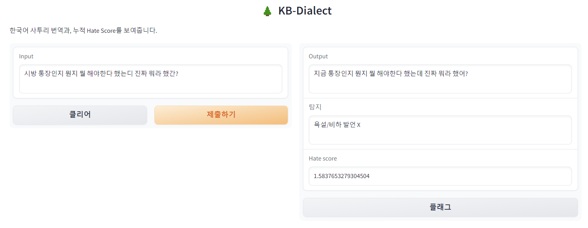

# dialect_translation <br>한국어 방언 -> 표준어 번역 AI 모델 만들기

## 1. 개요 <br>
KB 제 5회 Future Finance A.I. challenge 참여하면서, 주제로 상담 시, 사투리를 많이 쓰는 지방 사람들과 대화할 시, 사투리를 표준어로 변환하여, 좀 더 수월한 대화를 가능케 하기 위해 제안했음.<br>
(이후, 개요 부분은 아이디어의 구상 내용 뒷받침을 추가할 예정)

## 2. 활용 데이터셋
AI-Hub에서 제공하고 있는 '한국어 발화 데이터셋 (경상도, 강원도, 충청도, 전라도)' + '중,노년층 발화 데이터 (경상도) 중 1인 따라부르기 발화 셋'을 활용하였습니다. 발화 데이터셋 원본은 공유가 불가능하지만, Data_preprocessing을 통해, 사투리만 포함된 데이터만 뽑아내고, 
Data Downsampling을 통해 각 4개 도의 사투리 발화 Corpus 개수를 균일하게 맞췄다.<br>
원래 Downsampling을 거친 데이터셋의 총 량은 거의 80만개 Corpus를 가지고 있었으나,<br>
학습의 시간과 Colab runtime Error 때문에 부득이하게 데이터 개수를 1/8배하여 거의 10만개의 코퍼스를 가지고 진행하게 되었다. <br>
> ### 최종적으로 사용된 코퍼스 개수 
> #### Train : <br>
> * 강원도 : 23668 Corpus
> * 전라도 : 23512 Corpus
> * 충청도 : 23185 Corpus
> * 경상도 : 23432 Corpus
> 
> #### Valid / Test : <br>
> * 강원도 : 5049 / 5135 Corpus
> * 전라도 : 5015 / 5079 Corpus
> * 충청도 : 5227 / 5065 Corpus
> * 경상도 : 4935 / 4947 Corpus

## 3. 활용 모델 (Polyglot-ko-12.8b)<br> 
이번에 사용한 모델은 [**Polyglot-ko-12.8b**][polyglot] 모델을 사용하였다. 이 모델이 선택된 이유는 다음과 같습니다.<br>

<ol>
  1. GPT-NeoX 기반으로 한국어 데이터셋(863GB)으로 Pre-Trained된 모델. <br/>
  2. 한국어를 기반으로 Pre-Trained된 모델 중에서는 한국어 성능이 좋은 모델임. (나머지는 영어가 섞인 데이터셋을 통해 훈련된 모델에 한국어 양이 적음.) <br/>
  3. OpenSource로 풀려있음. 네이버 클로바는 유료이용에, 값이 비쌈
</ol> 

즉, 현재 사용되는 모델 중에서 가장 합리적이고, 성능도 괜찮고, 개인적으로 한번 튜닝해보고 싶었던 모델인 **Polyglot-ko-12.8b**를 선정<br>
[**네이버 클로바**][naver_clover]는 토큰당 0.02~0.04원이지만, 토큰이 많아질수록 비싸짐. 
<br>
> ### 현재 고려대에서 내놓은 [**Kullm-polyglot-12.8b-v2**][kullmv2] 모델이 있는데, 추후, 이 버전으로 리메이크 할 예정.

## 4. Alpaca-QLoRA
사용된 학습 방식은 **Alpaca-QLoRA**의 방식을 채용. <br>
또한, **4Bit-Quantization**를 이용한 LoRA방식을 도입하여, fine-tuning을 진행했음.<br>
[**Alpaca-qlora**][alpacaglora] 중, finetune.py를 조금 수정하였음 (허깅페이스 업로드 추가). 
(라이센스가 Apache2.0이라 여기에도 올린다.)<br>
> **학습환경은 Colab A100 40g환경에서 진행했습니다.**

```bash
python ./Alpaca-QLoRA/finetune.py \
  --base_model "EleutherAI/polyglot-ko-12.8b" \
  --train_data_path 'train_data_paths' \
  --valid_data_path 'valid_data_paths' \
  --hub_dir 'your huggingface dir' \
  --val_set_size 36000 \
  --num_epochs 1 \
  --learning_rate 1e-4 \
  --batch_size 256 \
  --micro_batch_size 16 \
  --lora_r 16 \
  --lora_target_modules "[query_key_value, xxx]" \
  --prompt_template_name 'custom_templete'
```
* val_set_size는 기존의 값이 아닌 임의값을 줬음.(finetuning하면서 임의로 했다가 이렇게 됨.)<br>
* num_epochs는 대형 LLM은 거의 1~5에포크 이내에도 Over-Fitting 문제가 잘 발생하므로, 1번만 진행 <br>
* learning_rate 는 최대값임. 즉, learning_rate는 최대로 저 값까지 올라갔다가 조정이 됨.<br>
* lora_r (Lora 랭크)는 초기는 8, 좀 더 학습 파라미터 수를 늘리고 싶으면 16, 32정도로 늘려도 됨. <br>
* lora_target_modules는 기본은 LLaMA 기반의 것을 사용하나, 현재 GPT-NeoX 포맷용으로 저 값을 사용 <br>
* prompt는 데이터셋 전처리 과정에서 프롬프트를 커스텀으로 하나 구성하였음.
* wandb를 통해 웹사이트에서 Training과정을 확인할 수 있음.<br>


## 5. 모델 테스트
학습한 모델을 테스트하고, BLEU 점수를 계산.
> **중요! Google Colab 환경에서 진행**, 추론 속도가 A100과 V100이 거의 비슷하기에 V100 환경에서 테스트 
```bash
python ./Model_Test/Model_Test.py \
	--base_model 'EleutherAI/polyglot-ko-12.8b' \
	--lora_weights 'Meohong/Dialect-Polyglot-12.8b-QLoRA' \
	--test_sets 'your test dataset'
```
* 평균적으로 문장 생성 하나 당 평균 7~10초 가량 걸렸음. (A100 환경에선 1초정도 더 빠르다고 생각하면 됨)
* 따라서, 테스트셋으로 2200개의 문장을 예측하고, BLEU점수를 계산하였음.
* 결과, _**BELU 평균 점수 : 84.20596426777675**_
* 22년 딥러닝 기반 한국어 방언 기계번역 연구 논문에서 나온 Transformer를 이용한 Many2One 모델보다는 매우 떨어지는 모습을 보였음.
* 아마도 **학습에 들인 데이터셋 수**와 데이터셋 처리방식을 개선한다면, 더 좋은 번역 성능을 보일 수 있을 것.<br>




## 6. 결론
* 생각보다 번역은 잘 이루어졌다고 생각했지만, 아직까지 매우 부족한 모습을 보여주는 것 같음.
* 이러한 이유로는 학습 데이터셋 부족과, 제대로 데이터셋을 전처리하지 않았다는 점, 학습 시간이 3시간30분 밖에 이루어지지 않았다는 점이다.
* 즉, Colab 학습을 좀 더 오래 하고, 데이터셋을 좀 더 증강시킬 수 있다면, 조금 더 나은 모습을 보여줄 수 있을 것.

## 번외. GGML 모델 변환
12.8B개의 파라미터를 가진 Polyglot-ko의 모델은 **GPU없이 돌지 못한다.** <br>
따라서, CPU RAM으로도 돌릴 수 있게 GGML로 변환해보고 그 성능을 시험해보고 싶었음. 
* GGML로 변환하기 전, LoRA 모듈과 원본 모듈을 하나로 병합하는 과정 필요.
```bash
python ./Model_Create/MergeModel.py \
	--source_path 'EleutherAI/polyglot-ko-12.8b' \
	--lora_path 'Meohong/Dialect-Polyglot-12.8b-QLoRA' \
	--dest_path 'save dir you want to'
```
* 병합한 모델과 원본 모델의 토크나이저, special_token.json, 토크나이저config.json을 하나의 모델 bin파일로 변환
```bash
python ./Model_Create/TransformGGML.py \
	--dir_model '저장한 모델 위치' \
	--dest_path 'save dir you want to'
```
> **원본 모델이 _28GB_ 정도 되기에 큰 용량을 차지한다. 충분한 RAM과 저장공간을 확보하기 바람.**
* 그 후, 4bit-Quantization을 진행한다. jupyter Notebook으로 제작함.
[GGML Quntization](https://colab.research.google.com/drive/13hDsA-k0Wvb3JWczkglgC4QX7zb0BGUY)

## 번외 2. Colab서버와 SSH연결 후, 로컬 PC 상에서 VSCode로 연결, 웹 앱을 통해 데이터 전달 및 처리
* 개인 PC의 환경은 보통 3070, 높아봐야 3080일 것이고, 대학생의 경우, 랩탑(노트북)을 통해 작업할 것이다. 또한, 라즈베리파이 등 임베디드 시스템을 통해 
A.I. 서비스를 제공하는 경우, 로컬 사양으로 처리하기 매우 힘들다. (가장 큰 이유는 RAM부족)
* 따라서, A.I. 서비스를 원활히 하기위해, SSH연결, Anvil Web Service를 이용하여, 처리 공간과 작업 공간을 따로 분리하였다.
* Colab, Local PC 둘다 pip install을 통해, anvil-uplink module을 다운로드 한다.<br>
```bash
pip install anvil-uplink
```
#### 1. **Colab-Local PC로 SSH 연결 Cloudflared 이용** (참고 : [Colab-ssh](https://github.com/WassimBenzarti/colab-ssh)
**ngrok**를 이용하는 방법은 다음 [Youtube](https://youtu.be/oAKxxLy-G5g?si=fiHhJFYB1nKwzadW)를 이용하시면 됩니다.
> 1. 먼저 Colab에서 다음을 진행한다.
> ```
> # Install colab_ssh on google colab
> !pip install colab_ssh --upgrade
> # After, Download required modules Optionally
> ```
> 2. 그 후, Colab에서 다음과 같이 셀을 작성
> ```
> from colab_ssh import launch_ssh_cloudflared, init_git_cloudflared
> launch_ssh_cloudflared(password="<PUT_YOUR_PASSWORD_HERE>")
> ```
> 3. 다음과 같이 셀이 실행된 모습이 보이면, VSCode Remote SSH의 내용 중 SSH주소를 카피하여, VScode로 넘어간다.
#### 2. 

## Acknowledgement
* [언어적 특성과 서비스를 고려한 딥러닝 기반 한국어 방언 기계번역 연구 (임상범 외 2명)][deepdialect]
* [LORA: LOW-RANK ADAPTATION OF LARGE LANGUAGE MODELS][LoRA]
* GGML모델 변환 참고한 자료 : ['그동안 한 시도들과 polyglot-QLora 활용 팁'][arcalive]


[polyglot]: https://huggingface.co/EleutherAI/polyglot-ko-12.8b
[kullmv2]: https://huggingface.co/nlpai-lab/kullm-polyglot-12.8b-v2
[naver_clover]: https://www.ncloud.com/product/aiService/clovaStudio
[alpacaglora]: https://github.com/vihangd/alpaca-qlora
[deepdialect]: https://koreascience.kr/article/JAKO202209542033704.pdf
[LoRA]: https://arxiv.org/pdf/2106.09685.pdf
[arcalive]: https://arca.live/b/alpaca/79988181?target=all&keyword=llama&p=1
